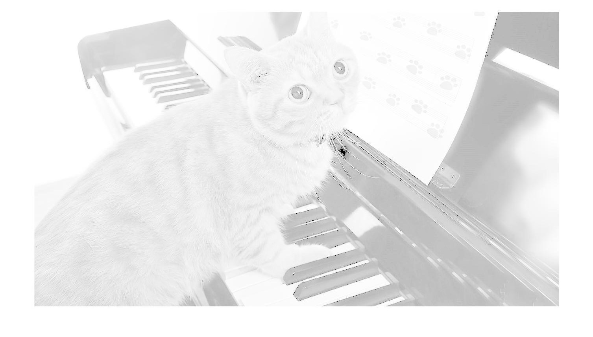
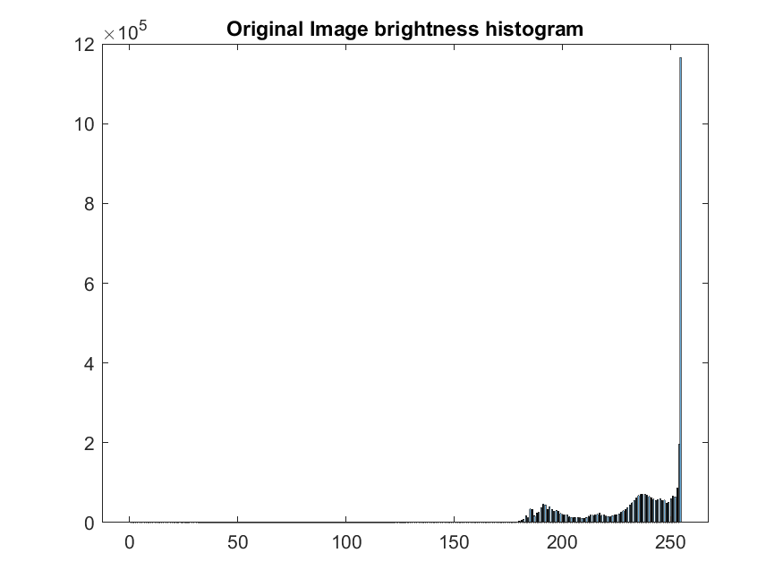
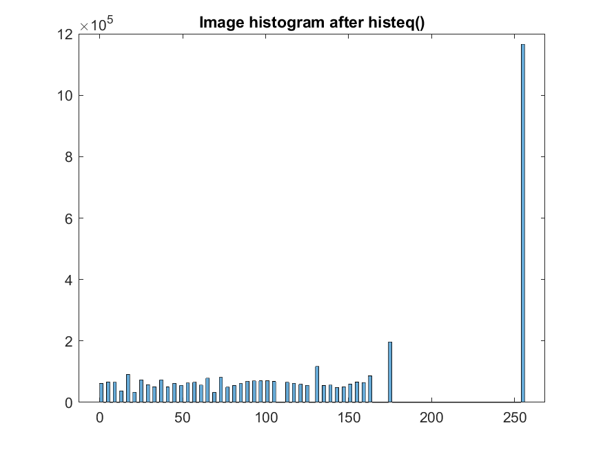
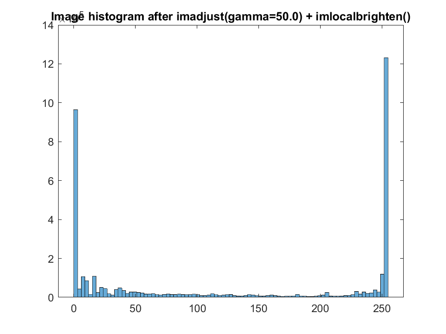
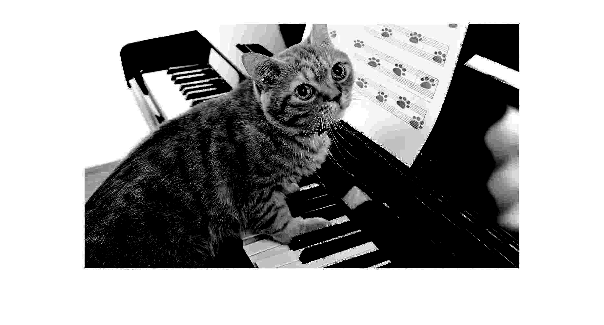

# Курс "Цифровая обработка изображений"
[Read in English][en]

## Лабораторная работа 2. Вариант 1

---
### Задание 1
1. Исходное изображение **Img2_01_1.jpg** представляет собой панорамную фотографию земной поверхности. Переведя к бинарному изображению с помощью пороговой обработки исходного изображения, найти 10 областей с наибольшей яркостью.
2. Определить координаты этих точек.

Скрипт решения: [Task01.m][Task01]

||
|:---:|
|Исходное изображение   ![source01_01]|
|10 областей с наибольшей яркостью   ![result01_01]|
|Координаты точек   ![result01_02]|

---
### Задание 2
1. Создать изображение белого прямоугольника на фоне черного квадрата: 
    - размеры квадрата равны 1001х1001 пикселей. 
    - размеры прямоугольника равны 81х201 пикселей.
2. Построить двумерный центрированный спектр изображения, используя стандартные функции **fft2** и **fftshift**.
3. Используя логарифмическое преобразование яркости, построить изображение спектра, на котором видна не только его центральная часть, но и поведение на краях изображения.
3. Путем изменения параметров логарифмической функции преобразования яркости обеспечить возможность изменения динамического диапазона яркости, при котором можно менять соотношения яркости на краях и в центре изображения спектра.
4. Определить динамический диапазон яркости спектра изображения до и после логарифмического преобразования яркости.
5. Построите одномерные графики спектра, соответствующие сечениям изображения горизонтальной и вертикальной линиями, проходящими через центр изображения спектра. Каждую пару графиков постройте для двух случаев: до и после логарифмического преобразования яркости.
5. Построить аналогичное изображение спектра для такого же прямоугольника, расположенного в верхнем левом краю пространственного изображения.

Скрипт решения: [Task02.m][Task02]

|||
|:---:|:---:|
|Белый прямоугольник в центре   ![result02_01]|Белый прямоугольник в левом верхнем углу   ![result02_08]|
|Центрированный спектр   ![result02_02]|Центрированный спектр    ![result02_09]|
|Логарифмическое преобразование яркости спектра: **K=0.01**   ![result02_03]|Логарифмическое преобразование яркости спектра: **K=0.01**   ![result02_10]|
|Логарифмическое преобразование яркости спектра: **K=1**   ![result02_04]|Логарифмическое преобразование яркости спектра: **K=1**   ![result02_11]|
|Логарифмическое преобразование яркости спектра: **K=100**   ![result02_05]|Логарифмическое преобразование яркости спектра: **K=100**   ![result02_12]|
|График спектра, соответствующие сечениям изображения горизонтальной и вертикальной линиями, проходящими через центр изображения спектра: **до логарифмического преобразования яркости K=1**   ![result02_06]|График спектра, соответствующие сечениям изображения горизонтальной и вертикальной линиями, проходящими через центр изображения спектра: **до логарифмического преобразования яркости K=1**   ![result02_13]|
|График спектра, соответствующие сечениям изображения горизонтальной и вертикальной линиями, проходящими через центр изображения спектра: **после логарифмического преобразования яркости K=1**   ![result02_07]|График спектра, соответствующие сечениям изображения горизонтальной и вертикальной линиями, проходящими через центр изображения спектра: **после логарифмического преобразования яркости K=1**   ![result02_14]|

---
### Задание 3
1. Дано изображение **Img2_01_3.jpg**. Построить гистограмму яркости заданного изображения.
2. Использовать функцию `imajust` для коррекции контраста. Построить гистограмму яркости скорректированного изображения.
3. Использовать функцию `histeq` для эквализации гистограммы. Построить гистограмму яркости после эквализации. 
4. Использовать функцию `imlocalbrighten` для улучшения контраста. Построить гистограмму скорректированного изображения.
5. Использовать функцию `imcontrast` для улучшения яркости и контраста. Построить гистограмму скорректированного изображения.

Скрипт решения: [Task03.m][Task03]

<table width="100%">
  <tr align="center">
    <td width="50%">
        Исходное изображение  
        
    </td>
    <td width="50%">
        Гистограмма яркости исходного изображения  
                
    </td>
  </tr>
  <tr align="center">
    <td width="50%">
        Изображение после коррекции контраста: <code>imadjust(gamma=25.0)</code>  
        
    </td>
    <td width="50%">
        Гистограмма яркости после коррекции яркости <code>imadjust(gamma=25.0)</code>  
                
    </td>
  </tr>
  <tr align="center">
    <td width="50%">
        Изображение после эквализация гистограммы: <code>histeq()</code>  
        
    </td>
    <td width="50%">
        Гистограмма яркости после эквализация гистограммы: <code>histeq()</code>  
                
    </td>
  </tr>
  <tr align="center">
    <td width="50%">
        Изображение после улучшения контраста: <code>imadjust(gamma=50.0) + imlocalbrighten(amount=0.5)</code>  
        
    </td>
    <td width="50%">
        Гистограмма яркости после улучшения контраста: <code>imadjust(gamma=50.0) + imlocalbrighten(amount=0.5)</code>  
                
    </td>
  </tr>
  <tr align="center">
    <td width="50%">
        Изображение после улучшения яркости и контраста: <code>imcontrast()</code>  
        
    </td>
    <td width="50%">
        Гистограмма яркости после улучшения яркости и контраста: <code>imcontrast()</code>  
                
    </td>
  </tr>
</table>

---
[en]: README.md
[ru]: README-ru.md
[Task01]: Task01.m
[Task02]: Task02.m
[Task03]: Task03.m
[source01_01]: resources/Img2_01_1.jpg
[source03_01]: resources/Img2_01_3.jpg
[result01_01]: results/lab02_opt01_task01_01.png
[result01_02]: results/lab02_opt01_task01_02.png

[result02_01]: results/lab02_opt01_task02_01.png
[result02_02]: results/lab02_opt01_task02_02.png
[result02_03]: results/lab02_opt01_task02_03.png
[result02_04]: results/lab02_opt01_task02_04.png
[result02_05]: results/lab02_opt01_task02_05.png
[result02_06]: results/lab02_opt01_task02_06.png
[result02_07]: results/lab02_opt01_task02_07.png
[result02_08]: results/lab02_opt01_task02_08.png
[result02_09]: results/lab02_opt01_task02_09.png
[result02_10]: results/lab02_opt01_task02_10.png
[result02_11]: results/lab02_opt01_task02_11.png
[result02_12]: results/lab02_opt01_task02_12.png
[result02_13]: results/lab02_opt01_task02_13.png
[result02_14]: results/lab02_opt01_task02_14.png

[result03_01]: results/lab02_opt01_task03_01.png
[result03_02]: results/lab02_opt01_task03_02.png
[result03_03]: results/lab02_opt01_task03_03.png
[result03_04]: results/lab02_opt01_task03_04.png
[result03_05]: results/lab02_opt01_task03_05.png
[result03_06]: results/lab02_opt01_task03_06.png
[result03_07]: results/lab02_opt01_task03_07.png
[result03_08]: results/lab02_opt01_task03_08.png
[result03_09]: results/lab02_opt01_task03_09.png
