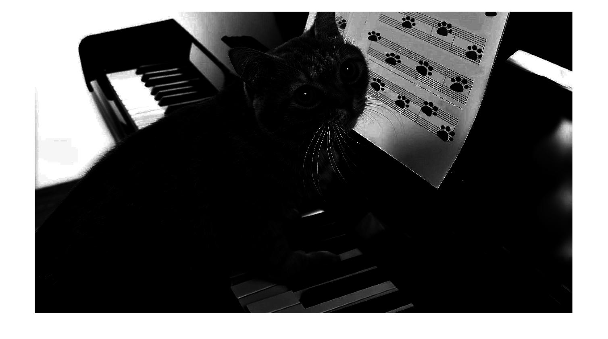
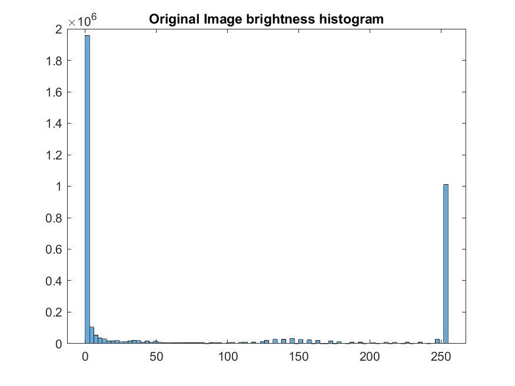
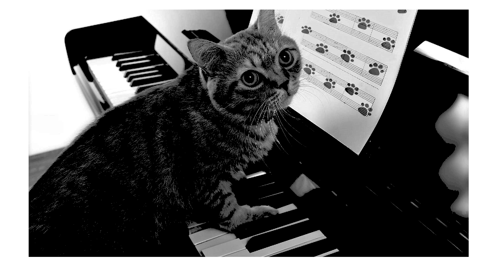
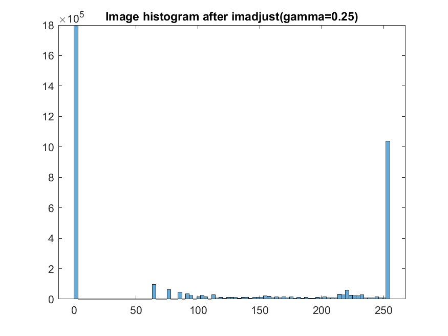
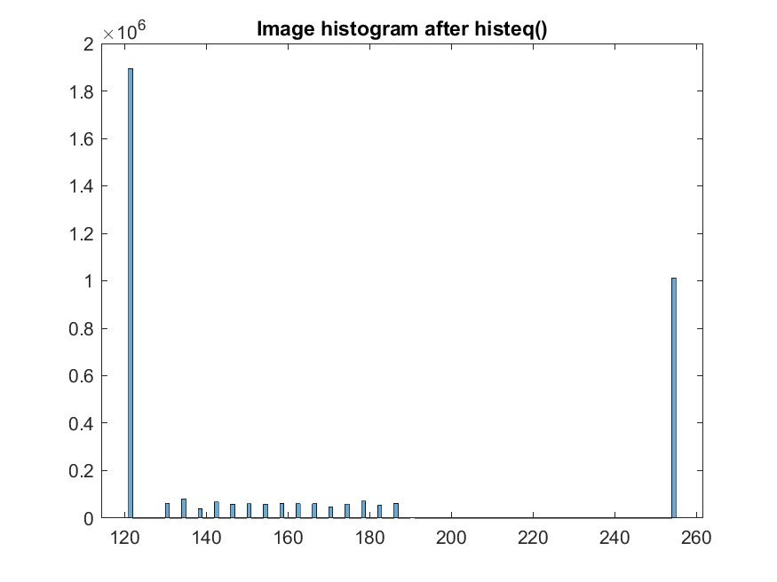
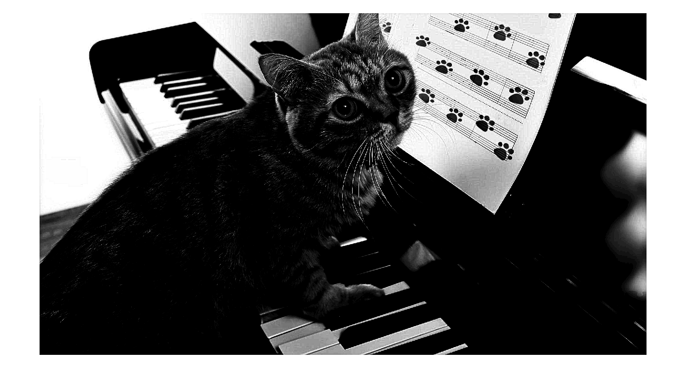
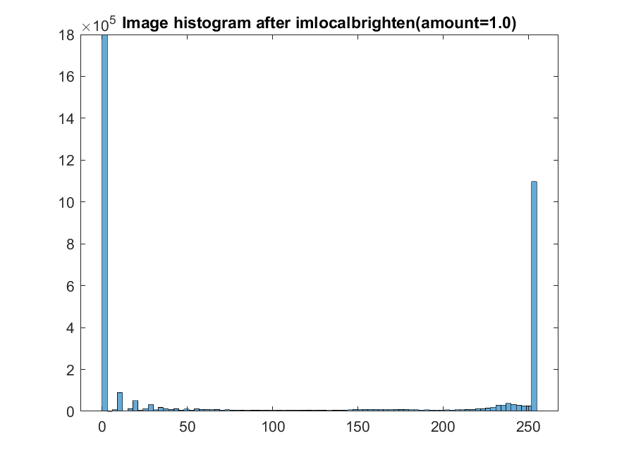
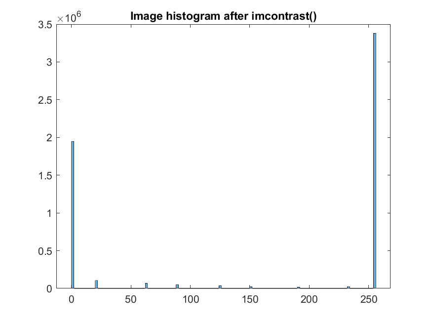

# Course "Digital Image Processing"
[Read in Russian][ru]

## Laboratory work 2. Option 2

---
### Task 1
1. The original image **Img2_02_1.jpg** is a panoramic photograph of the earth's surface. Create a binary image using thresholding using different thresholdings: 0.3, 0.5, 0.8, 0.9 of the maximum value.

Solution script: [Task01.m][Task01]

|||
|:---:|:---:|
|Original image   ![source01_01]|Binary image: `Threshold=0.3`   ![result01_01]|
|Binary image: `Threshold=0.5`   ![result01_02]|Binary image: `Threshold=0.8`   ![result01_03]|
|Binary image: `Threshold=0.9`   ![result01_04]||

---
### Task 2
1. Create an image of a white ellipse on a black square background:
    - the dimensions of the square are **1001x1001 pixels**.
    - the dimensions of the axes of the ellipse are **81x201 pixels**.
2. Construct a 2D centered spectrum of the image using the standard `fft2` and `fftshift` functions.
3. Using the logarithmic transformation of brightness, construct an image of the spectrum, which shows not only its central part, but also the behavior at the edges of the image.
4. By changing the parameters of the logarithmic brightness conversion function, provide the ability to change the dynamic range of brightness, in which it is possible to change the ratio of brightness at the edges and in the center of the spectrum image.
5. Determine the dynamic range of the brightness of the image spectrum before and after the logarithmic transformation of the brightness.

Solution script: [Task02.m][Task02]

|||
|:---:|:---:|
|Image of a white ellipse   ![result02_01]|Centered spectrum   ![result02_02]|
|Logarithmic transformation of the spectrum brightness: ${{K=10^2}}$   ![result02_03]|Logarithmic transformation of the spectrum brightness: ${{K=10^4}}$   ![result02_04]|
|Logarithmic transformation of the spectrum brightness: ${{K=10^6}}$   ![result02_05]||
|Spectrum plot corresponding to image cross-sections with horizontal and vertical lines passing through the center of the spectrum image: **before the logarithmic transformation of brightness** ${{K=10^4}}$   ![result02_06]|Spectrum plot corresponding to image cross-sections with horizontal and vertical lines passing through the center of the spectrum image: **before the logarithmic transformation of brightness** ${{K=10^4}}$   ![result02_07]|

---
### Task 3
1. Given the image **Img2_02_3.jpg**. Construct a histogram of the brightness of the specified image.
2. Use the `imajust` function to correct the contrast. Construct a histogram of the brightness of the corrected image.
3. Use the `histeq` function to equalize the histogram. Build a histogram of luminance after equalization.
4. Use the `imlocalbrighten` function to improve contrast. Construct a histogram of the corrected image.
5. Use the `imcontrast` function to improve brightness and contrast. Construct a histogram of the corrected image.

Solution script: [Task03.m][Task03]

<table width="100%">
  <tr align="center">
    <td width="50%">
        Original image  
        
    </td>
    <td width="50%">
        Brightness histogram of the original image  
                
    </td>
  </tr>
  <tr align="center">
    <td width="50%">
        Image after contrast correction: <code>imadjust(gamma=0.25)</code>  
        
    </td>
    <td width="50%">
        Brightness histogram after brightness correction <code>imadjust(gamma=0.25)</code>  
                
    </td>
  </tr>
  <tr align="center">
    <td width="50%">
        Image after histogram equalization: <code>histeq()</code>  
        
    </td>
    <td width="50%">
        Brightness histogram after histogram equalization: <code>histeq()</code>  
                
    </td>
  </tr>
  <tr align="center">
    <td width="50%">
        Image after contrast improvement: <code>imlocalbrighten(amount=1.0)</code>  
        
    </td>
    <td width="50%">
        Brightness histogram after contrast improvement: <code>imlocalbrighten(amount=1.0)</code>  
                
    </td>
  </tr>
  <tr align="center">
    <td width="50%">
        Image after improving brightness and contrast: <code>imcontrast()</code>  
        
    </td>
    <td width="50%">
        Brightness histogram after improving brightness and contrast: <code>imcontrast()</code>  
                
    </td>
  </tr>
</table>

---
[en]: README.md
[ru]: README-ru.md
[Task01]: Task01.m
[Task02]: Task02.m
[Task03]: Task03.m

[source01_01]: resources/Img2_02_1.jpg
[source03_01]: resources/Img2_02_3.jpg

[result01_01]: results/lab02_opt02_task01_01.png
[result01_02]: results/lab02_opt02_task01_02.png
[result01_03]: results/lab02_opt02_task01_03.png
[result01_04]: results/lab02_opt02_task01_04.png

[result02_01]: results/lab02_opt02_task02_01.png
[result02_02]: results/lab02_opt02_task02_02.png
[result02_03]: results/lab02_opt02_task02_03.png
[result02_04]: results/lab02_opt02_task02_04.png
[result02_05]: results/lab02_opt02_task02_05.png
[result02_06]: results/lab02_opt02_task02_06.png
[result02_07]: results/lab02_opt02_task02_07.png

[result03_01]: results/lab02_opt02_task03_01.png
[result03_02]: results/lab02_opt02_task03_02.png
[result03_03]: results/lab02_opt02_task03_03.png
[result03_04]: results/lab02_opt02_task03_04.png
[result03_05]: results/lab02_opt02_task03_05.png
[result03_06]: results/lab02_opt02_task03_06.png
[result03_07]: results/lab02_opt02_task03_07.png
[result03_08]: results/lab02_opt02_task03_08.png
[result03_09]: results/lab02_opt02_task03_09.png
