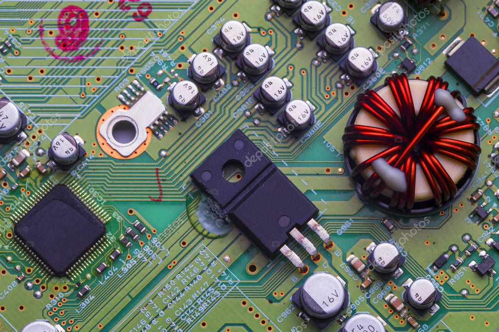

[<< На главную][main_ru] 

# Курс "Цифровая обработка изображений"
[Read in English][en]

## Лабораторная работа 3. Вариант 1

---
### Задание 1
1.  Моделирование искажения изображений с помощью шумов. Провести моделирование искажения изображения **[Img3_01_1.jpg][source01_01]** путем 
добавления следующих шумов: 
    - гауссовский шум
    - шум типа "соль и перец".

Скрипт решения: [Task01.m][Task01]

    Исходное изображение 
    </img>

|||
|:---:|:---:|
|||
|Гауссовский шум: среднее 0, дисперсия 0.01  ![result01_01]|Шум типа "Соль и перец": плотность 0.05  ![result01_04]|
|Гауссовский шум: среднее 0.25, дисперсия 0.01  ![result01_02]|Шум типа "Соль и перец": плотность 0.25  ![result01_05]|
|Гауссовский шум: среднее 0.25, дисперсия 0.05  ![result01_03]|Шум типа "Соль и перец": плотность 0.50  ![result01_06]|

маски фильтрации
---
### Задание 2
1. Составить программу, выполняющую подавление шумов с помощью масочных фильтров следующего вида:
    - среднеарифметический;
    - среднегеометрический;
    - среднегармонический;
    - медианный.
2. Провести исследование эффективности подавления шумов обоих видов (гауссовского и "соль и перец"»") при различных уровнях зашумления и при использовании фильтров различного вида.
    
Скрипт решения: [Task02.m][Task02]

||Фильтарция гауссовского шума||
|:---:|:---:|:---:|
|Гауссовский шум: среднее 0.0, дисперсия 0.01  ![result01_01]|Гауссовский шум: среднее 0.25, дисперсия 0.01  ![result01_02]|Гауссовский шум: среднее 0.25, дисперсия 0.05  ![result01_03]|
|Полутоновое зашумленное изображение  ![result02_01g_gray]|Полутоновое зашумленное изображение  ![result02_02g_gray]|Полутоновое зашумленное изображение  ![result02_03g_gray]|
|Среднеарифметическая фильтрация с маской ${{3х3}}$ ![result02_01g_avg]|Среднеарифметическая фильтрация с маской ${{3х3}}$ ![result02_02g_avg]|Среднеарифметическая фильтрация с маской ${{3х3}}$ ![result02_03g_avg]|
|Среднегеометрическая фильтрация с маской ${{3х3}}$ ![result02_01g_avgGeom]|Среднегеометрическая фильтрация с маской ${{3х3}}$ ![result02_02g_avgGeom]|Среднегеометрическая фильтрация с маской ${{3х3}}$ ![result02_03g_avgGeom]|
|Среднегармоническая фильтрация с маской ${{3х3}}$ ![result02_01g_avgHarmonic]|Среднегармоническая фильтрация с маской ${{3х3}}$ ![result02_02g_avgHarmonic]|Среднегармоническая фильтрация с маской ${{3х3}}$ ![result02_03g_avgHarmonic]|
|Медианная фильтрация  ![result02_01g_median]|Медианная фильтрация  ![result02_02g_median]|Медианная фильтрация  ![result02_03g_median]|

||Фильтарция шума "Соль и перец"||
|:---:|:---:|:---:|
|Шум "Соль и перец": плотность 0.05  ![result01_04]|Шум "Соль и перец": плотность 0.25  ![result01_05]|Шум "Соль и перец": плотность 0.50  ![result01_06]|
|Полутоновое зашумленное изображение  ![result02_04sp_gray]|Полутоновое зашумленное изображение  ![result02_05sp_gray]|Полутоновое зашумленное изображение  ![result02_06sp_gray]|
|Среднеарифметическая фильтрация с маской ${{3х3}}$ ![result02_04sp_avg]|Среднеарифметическая фильтрация с маской ${{3х3}}$ ![result02_05sp_avg]|Среднеарифметическая фильтрация с маской ${{3х3}}$ ![result02_06sp_avg]|
|Среднегеометрическая фильтрация с маской ${{3х3}}$ ![result02_04sp_avgGeom]|Среднегеометрическая фильтрация с маской ${{3х3}}$ ![result02_05sp_avgGeom]|Среднегеометрическая фильтрация с маской ${{3х3}}$ ![result02_06sp_avgGeom]|
|Среднегармоническая фильтрация с маской ${{3х3}}$ ![result02_04sp_avgHarmonic]|Среднегармоническая фильтрация с маской ${{3х3}}$ ![result02_05sp_avgHarmonic]|Среднегармоническая фильтрация с маской ${{3х3}}$ ![result02_06sp_avgHarmonic]|
|Медианная фильтрация  ![result02_04sp_median]|Медианная фильтрация  ![result02_05sp_median]|Медианная фильтрация  ![result02_06sp_median]|

---
### Задание 3
1. Использование Лапласиана.
    1. Используя расфокусировку с помощью гауссовского фильтра получить слегка размытое изображение
    2. Используя Лапласиан улучшить резкость изображения.
    3. Используйте 2 функции **Matlab**: `imfilter` с маской Лапласиана и `locallapfilt`. Сравните результаты улучшения изображения.
2. Использование маски Собела.
    1. Используя такую же расфокусировку заданного изображения, что и в п. 1.1, улучшить резкость с помощью масочного фильтра Собела.
    2. Сравнить эффективность работы двух алгоритмов улучшения резкости изображения: Лапласиана и оператора Собела

Скрипт решения: [Task03.m][Task03]

---
[en]: README.md
[ru]: README-ru.md

[main_en]: ../README.md
[main_ru]: ../README-ru.md

[Task01]: Task01.m
[Task02]: Task02.m
[Task03]: Task03.m

[source01_01]: resources/Img3_01_1.jpg

[result01_01]: results/lab03_opt01_task01_gaussian_01.jpg
[result01_02]: results/lab03_opt01_task01_gaussian_02.jpg
[result01_03]: results/lab03_opt01_task01_gaussian_03.jpg
[result01_04]: results/lab03_opt01_task01_salt&pepper_01.jpg
[result01_05]: results/lab03_opt01_task01_salt&pepper_02.jpg
[result01_06]: results/lab03_opt01_task01_salt&pepper_03.jpg

[result02_01g_gray]:         results/lab03_opt01_task02_gaussian_01_gray.jpg
[result02_01g_avg]:          results/lab03_opt01_task02_gaussian_01_avgFilter.jpg
[result02_01g_avgGeom]:      results/lab03_opt01_task02_gaussian_01_avgGeomFilter.jpg
[result02_01g_avgHarmonic]:  results/lab03_opt01_task02_gaussian_01_avgHarmonicFilter.jpg
[result02_01g_median]:       results/lab03_opt01_task02_gaussian_01_medianFilter.jpg

[result02_02g_gray]:         results/lab03_opt01_task02_gaussian_02_gray.jpg
[result02_02g_avg]:          results/lab03_opt01_task02_gaussian_02_avgFilter.jpg
[result02_02g_avgGeom]:      results/lab03_opt01_task02_gaussian_02_avgGeomFilter.jpg
[result02_02g_avgHarmonic]:  results/lab03_opt01_task02_gaussian_02_avgHarmonicFilter.jpg
[result02_02g_median]:       results/lab03_opt01_task02_gaussian_02_medianFilter.jpg

[result02_03g_gray]:         results/lab03_opt01_task02_gaussian_03_gray.jpg
[result02_03g_avg]:          results/lab03_opt01_task02_gaussian_03_avgFilter.jpg
[result02_03g_avgGeom]:      results/lab03_opt01_task02_gaussian_03_avgGeomFilter.jpg
[result02_03g_avgHarmonic]:  results/lab03_opt01_task02_gaussian_03_avgHarmonicFilter.jpg
[result02_03g_median]:       results/lab03_opt01_task02_gaussian_03_medianFilter.jpg

[result02_04sp_gray]:         results/lab03_opt01_task02_salt&pepper_01_gray.jpg
[result02_04sp_avg]:          results/lab03_opt01_task02_salt&pepper_01_avgFilter.jpg
[result02_04sp_avgGeom]:      results/lab03_opt01_task02_salt&pepper_01_avgGeomFilter.jpg
[result02_04sp_avgHarmonic]:  results/lab03_opt01_task02_salt&pepper_01_avgHarmonicFilter.jpg
[result02_04sp_median]:       results/lab03_opt01_task02_salt&pepper_01_medianFilter.jpg

[result02_05sp_gray]:         results/lab03_opt01_task02_salt&pepper_02_gray.jpg
[result02_05sp_avg]:          results/lab03_opt01_task02_salt&pepper_02_avgFilter.jpg
[result02_05sp_avgGeom]:      results/lab03_opt01_task02_salt&pepper_02_avgGeomFilter.jpg
[result02_05sp_avgHarmonic]:  results/lab03_opt01_task02_salt&pepper_02_avgHarmonicFilter.jpg
[result02_05sp_median]:       results/lab03_opt01_task02_salt&pepper_02_medianFilter.jpg

[result02_06sp_gray]:         results/lab03_opt01_task02_salt&pepper_03_gray.jpg
[result02_06sp_avg]:          results/lab03_opt01_task02_salt&pepper_03_avgFilter.jpg
[result02_06sp_avgGeom]:      results/lab03_opt01_task02_salt&pepper_03_avgGeomFilter.jpg
[result02_06sp_avgHarmonic]:  results/lab03_opt01_task02_salt&pepper_03_avgHarmonicFilter.jpg
[result02_06sp_median]:       results/lab03_opt01_task02_salt&pepper_03_medianFilter.jpg

[result03_01]: results/lab02_opt02_task03_01.png
