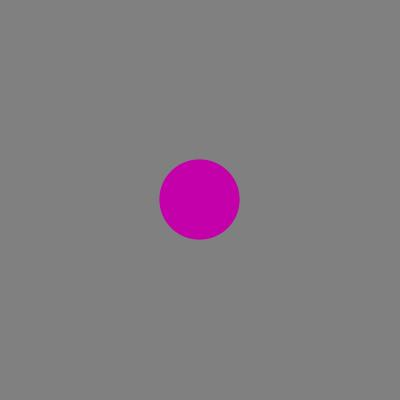
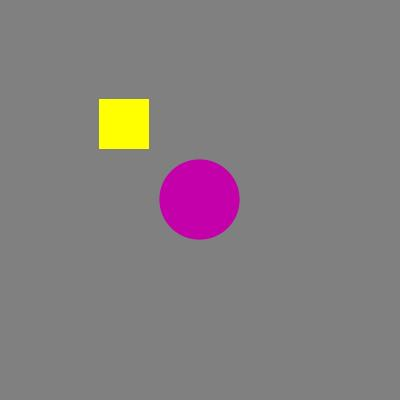
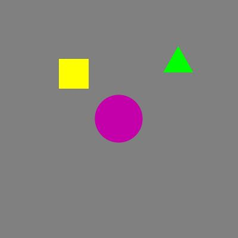
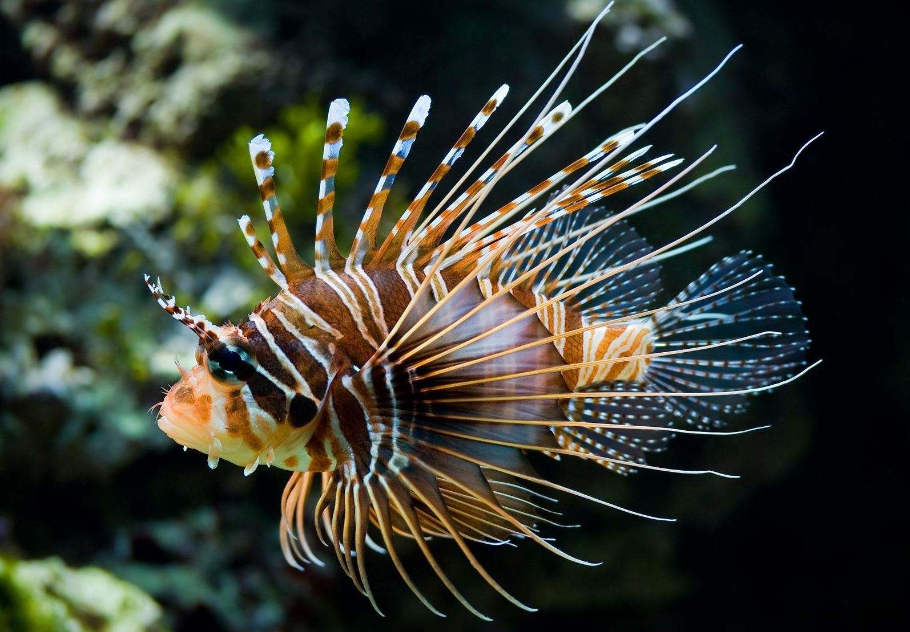
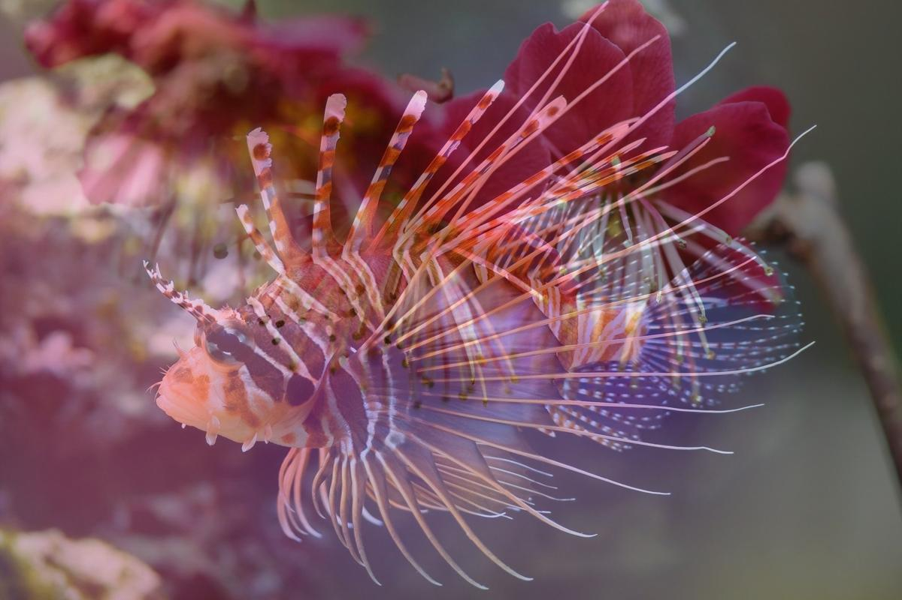

# Курс "Цифровая обработка изображений"

## Лабораторная работа №1. Вариант 1

### Задание 1
> 1. Создать изображение на темно-сером фоне, размером 400 х 400 пикселей.
> 2. В центре созданного изображения поместить круг радиусом 40 пикселей пурпурного цвета.
> 3. В левом верхнем углу изображения поместить желтый квадрат размером 50 х 50 пикселей с центром в точке (100, 100).
> 4. В правом верхнем углу изображения поместить равносторонний треугольник со сторонами в 50 пикселей. Цвет треугольника зеленый, центр его расположения в точке  (100, 300).
> 5. Результирующее изображение записать в файл типа *jpg*.

Скрипт решения: [Task1.m](Task1.m)

Результаты:

1. Серый квадрат:    

2. Серый квадрат + пурпурный круг:   

3. Серый квадрат + пурпурный круг + желтый квадрат:   

4. Серый квадрат + пурпурный круг + желтый квадрат + зеленый треугольник:   

### Задание 2
> 1. Даны два изображения Pic_12_1.jpg и Pic_12_2.jpg.
> 2. Создайте изображение, являющееся совмещением  двух заданных изображений таким образом, чтобы на совмещенном изображении можно было менять яркость одного изображения относительно другого.
> 3. Запишите результирующие изображения в файл в формате jpg.

Скрипт решения: [Task2.m](Task2.m)

Результаты:

1. Исходное изображение 1:

2. Исходное изображение 2

3. Совмещенное изображение

