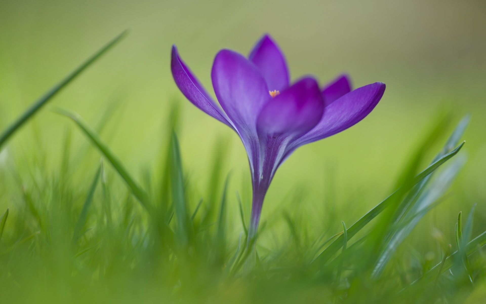
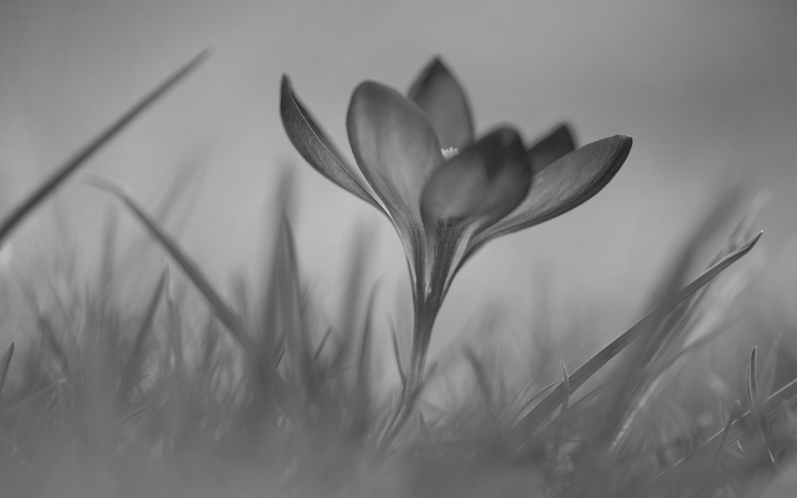
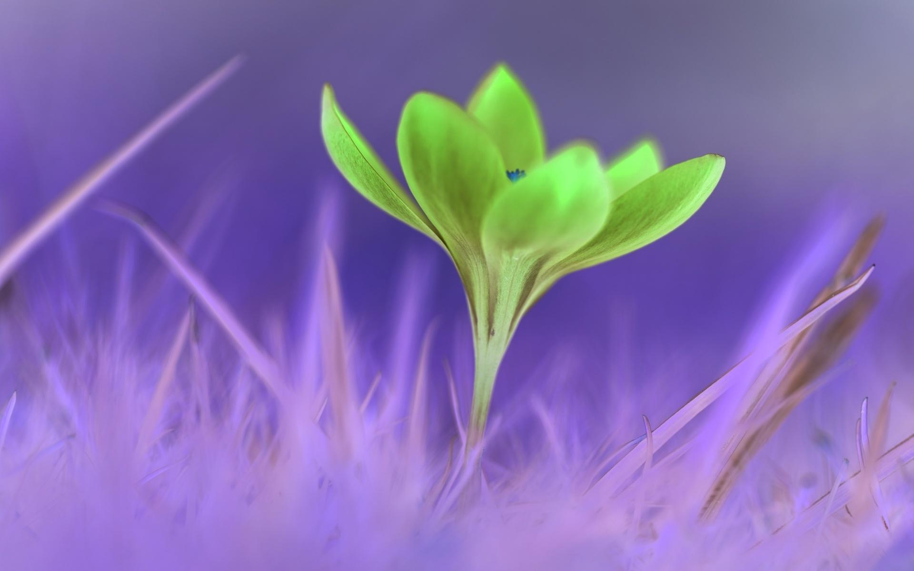
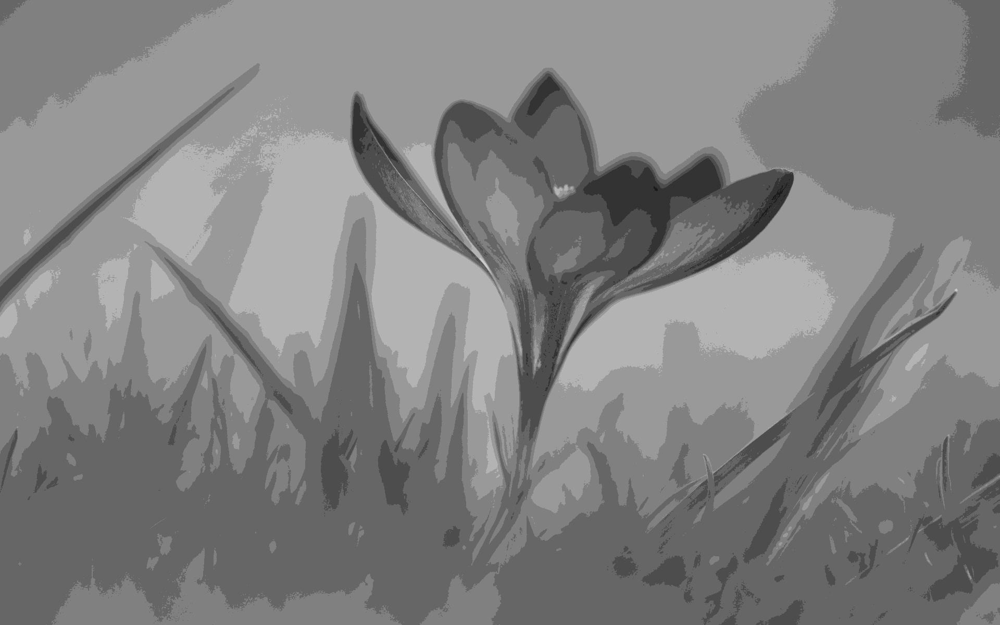

# Курс "Цифровая обработка изображений"

## Лабораторная работа №1. Вариант 7

### Задание 1
> 1. На заданном изображении постройте прямоугольную сетку с возможностью выбора следующих параметров сетки:
расстояние между линиями, толщина линий, цвет линий сетки.
> 2. Поместите на изображении круг с возможностью выбора его центра, радиуса и цвета. Круг должен быть полупрозрачным, т.е. через него должно просматриваться исходное изображение.
> 3. Поместите на изображении квадрат с возможностью выбора его центра, размера стороны и цвета. Квадрат должен быть полупрозрачным.
> 4. Запишите результирующее изображение в файл в формате bmp.

Скрипт решения: [Task1.m](Task1.m)

Результаты:

1. Исходное изображение:

2. Исходное изображение + прямоугольная сетка

3. Исходное изображение + прямоугольная сетка + полупрозрачный круг

4. Исходное изображение + прямоугольная сетка + полупрозрачные круг и квадрат

### Задание 2
> 1. Переведите изображение в формат полутонового. 
> 2. Создайте негативное изображение. 
> 3. Создайте полутоновое изображение с заданным числом градаций серого цвета. 
> 4. Переведите полутоновое изображение в палитровое изображение с заданной матрицей палитры.
> 5. Запишите результирующие изображения в файл в формате jpg.

Скрипт решения: [Task2.m](Task2.m)

Результаты:

1. Исходное изображение:

2. Полутоновое изображение

3. Негативное изображение

4. Полутоновое с заданным числом градаций (N = 10)

5. Палитровое изображение (палитра - WINTER)
