# Курс "Цифровая обработка изображений"

## Лабораторная работа №1. Вариант 7

### Задание 1
Исходное изображение **Img2_02_1.jpg.** представляет собой панорамную фотографию земной поверхности. Необходимо построить бинарное изображение с помощью пороговой обработки, используя различные значения порогов: 0.3, 0.5, 0.8, 0.9 от максимального значения. Исходное изображение: 
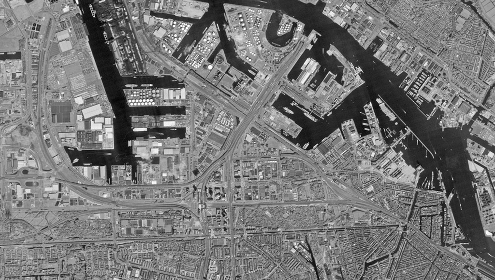 

Скрипт решения: [Task1.m](Task1.m)

Результаты:
1. Бинарное изображение при пороге 0.3:

2. Бинарное изображение при пороге 0.5:
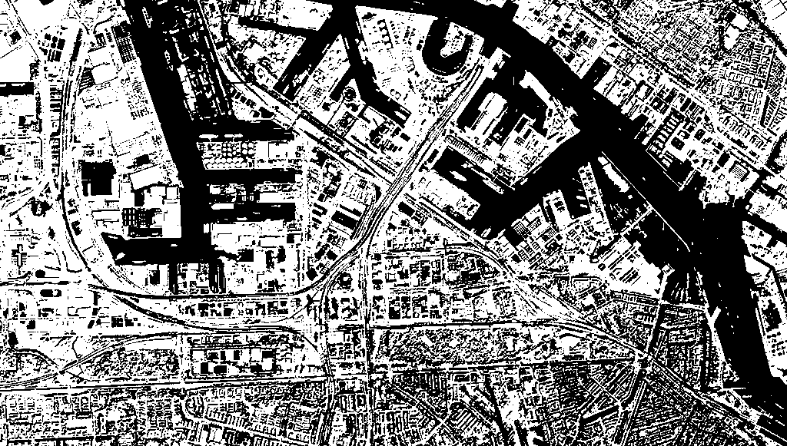

3. Бинарное изображение при пороге 0.8:
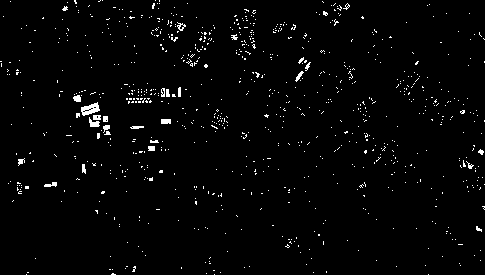

4. Бинарное изображение при пороге 0.9:
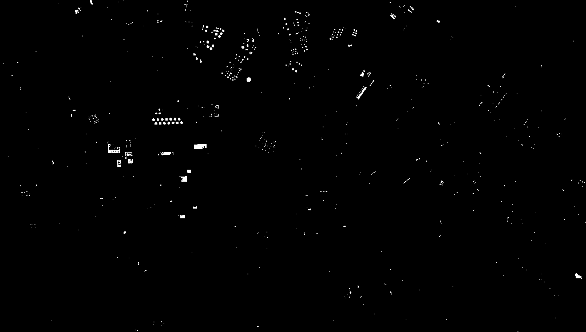

### Задание 2 
Создать изображение белого эллипса на фоне черного квадрата. Размеры квадрата, совпадающие с размерами всего изображения, равны 1001 х 1001 пикселей. Размеры осей эллипса равны 81 х 201 пикселей. 

Пострить двумерный центрированный спектр изображения, используя стандартные функции **fft2** и **fftshift**.

Скрипт решения: [Task2.m](Task2.m)

Результаты:
1. Бинарное изображение эллипса на черном квадрате:
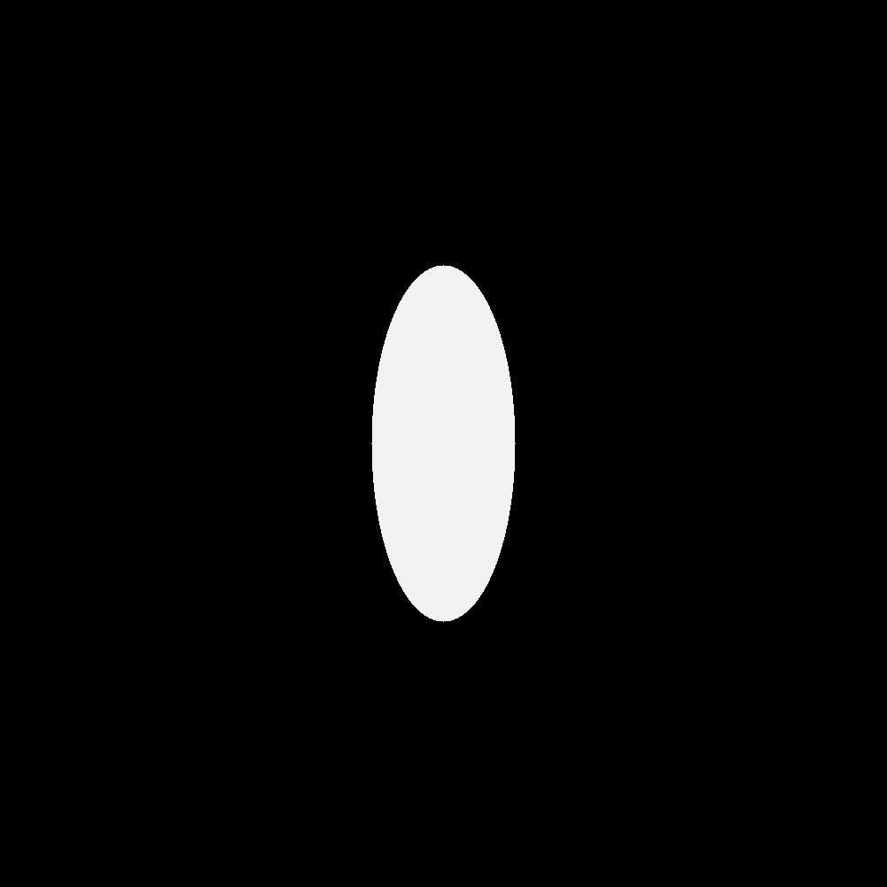

2. Изображение центрированного спектра эллипса:
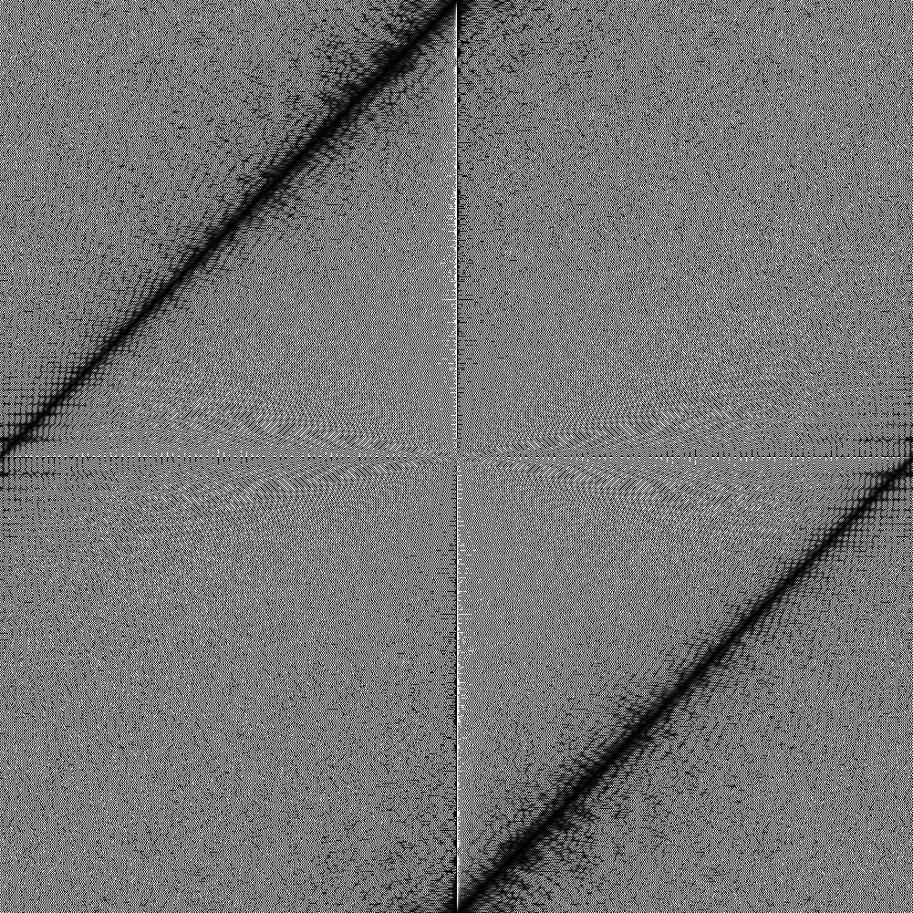

### Задание 3
Дано изображение: 
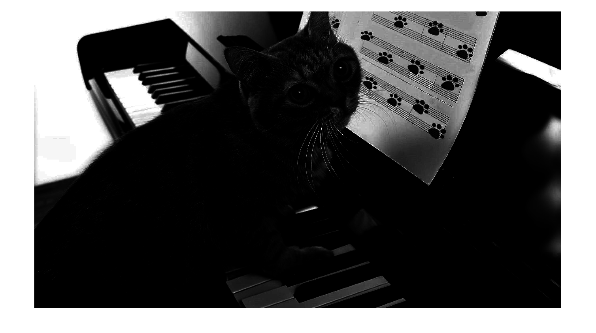 
Необходимо:
- Построить гистограмму яркости заданного изображения
- Использовать функцию **imadjust** для коррекции контраста. Построить гистограмму яркости скорректированного изображения
- Использовать функцию **histeq** для эквализации гистограммы. Построить гистограмму яркости после эквализации 
- Использовать функцию **imlocalbrighten** для улучшения контраста. Построить гистограмму скорректированного изображения
- Используовать функцию **imcontrast** для улучшения яркости и контраста. Построить гистограмму скорректированного изображения

Скрипт решения: [Task3.m](Task1.m)

Результаты:
1. Гистограмма яркости исходного изображения:
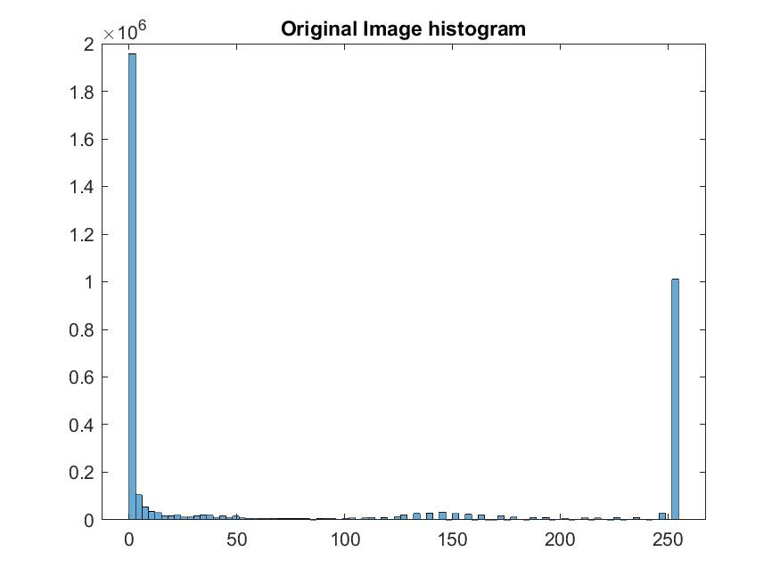

2. Изображение после применения функции **imadjust** для коррекции контраста:
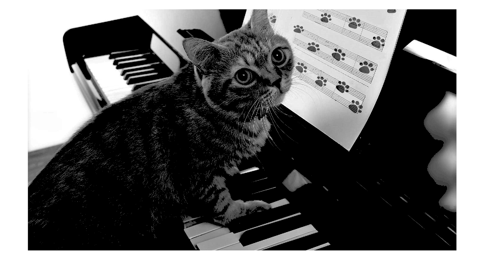

3. Гистограмма яркости изображения после применения функции **imadjust**:
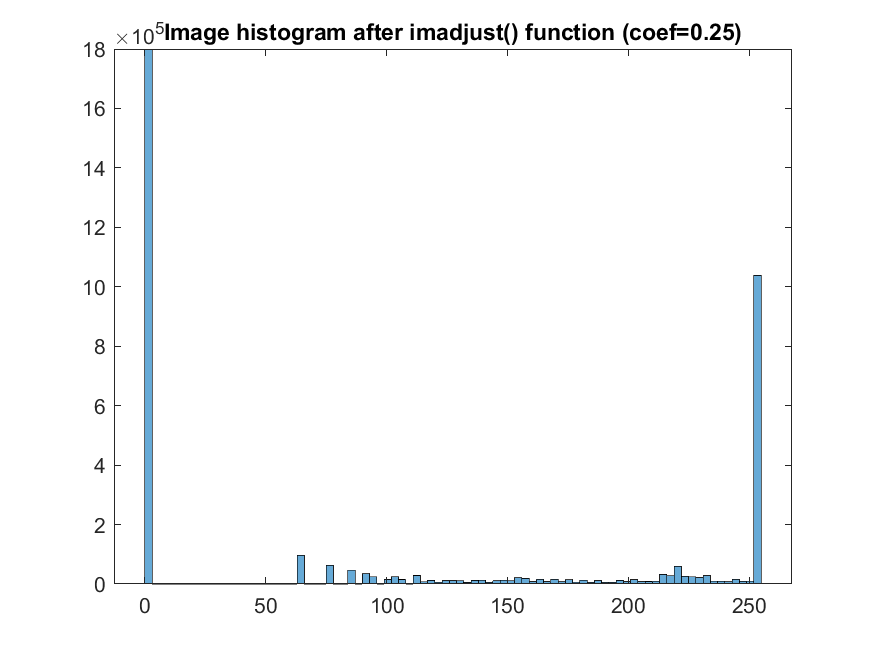

4. Изображение после применения функции **histeq** для экализации гистограммы:
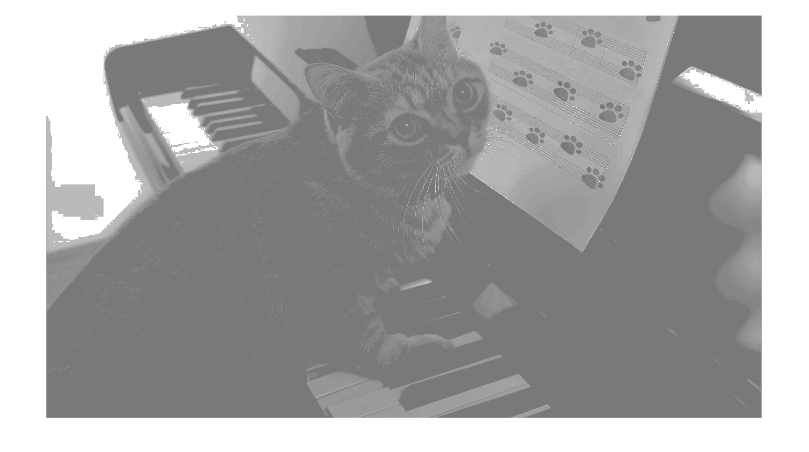

5. Гистограмма яркости изображения после применения функции **histeq**:
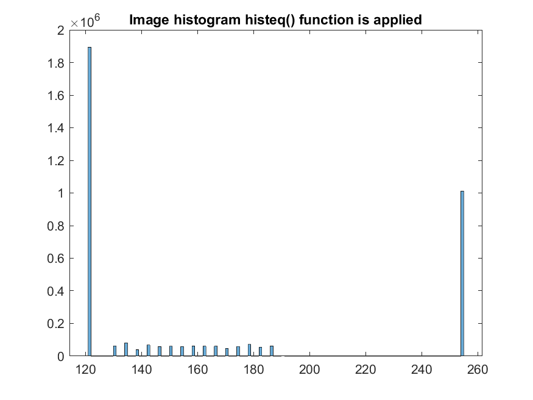

6. Изображение после применения функции **imlocalbrighten** для коррекции контраста:

7. Гистограмма яркости изображения после применения функции **imlocalbrighten**:
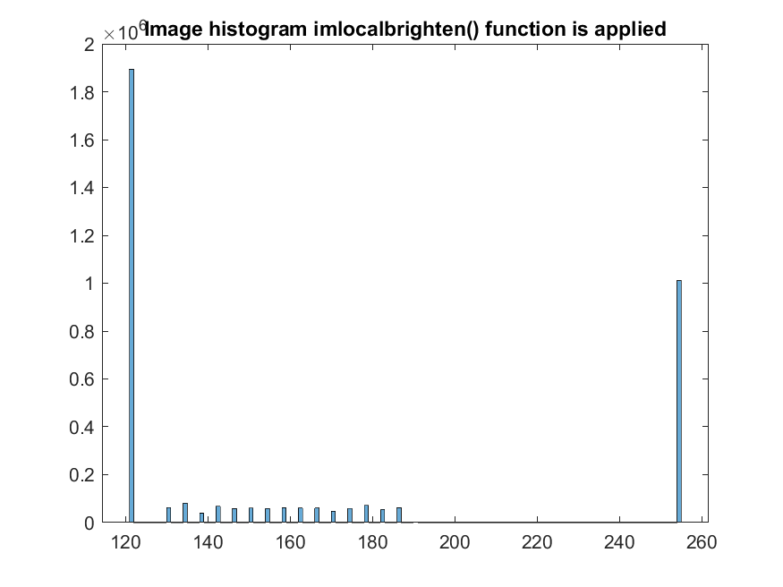

8. Изображение после применения функции **imcontrast** для коррекции контраста:
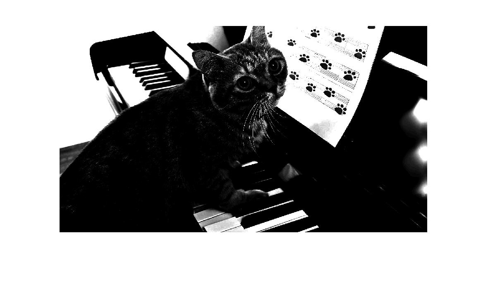

9. Гистограмма яркости изображения после применения функции **imcontrast**:
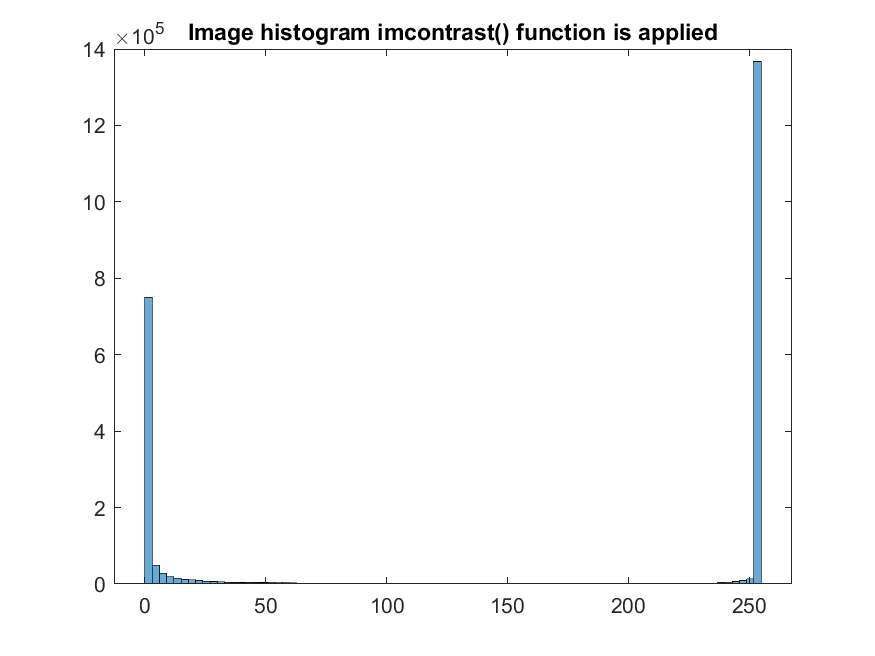

